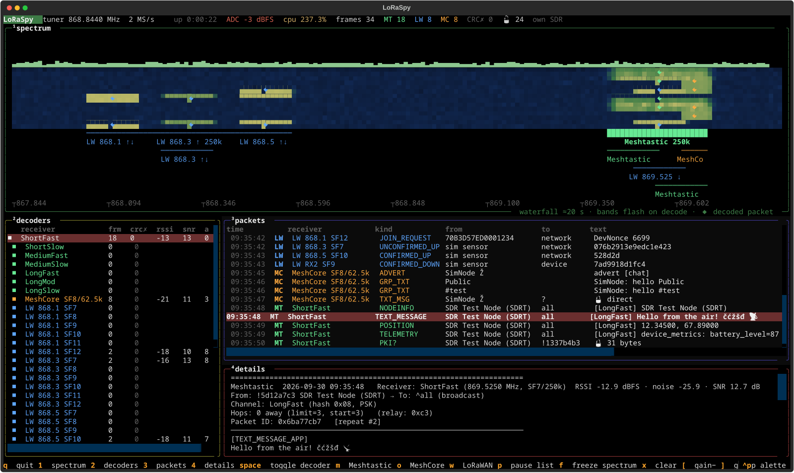
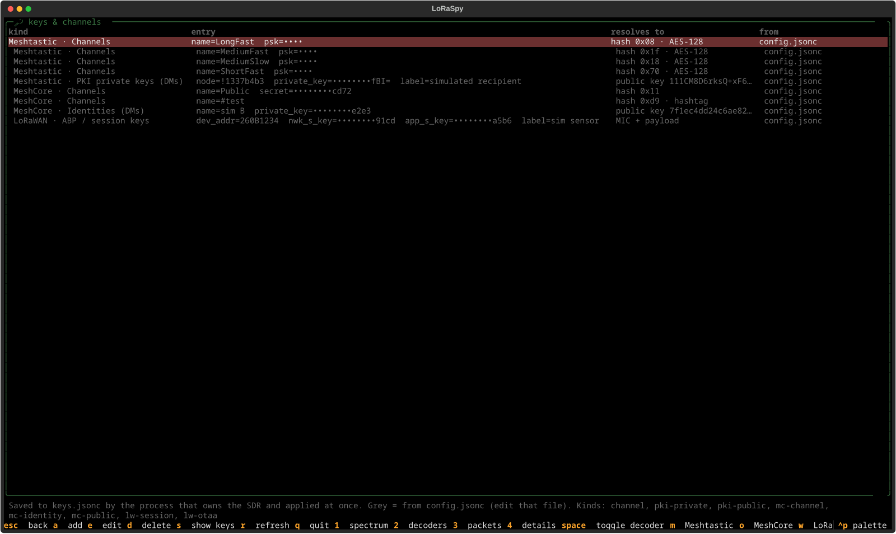
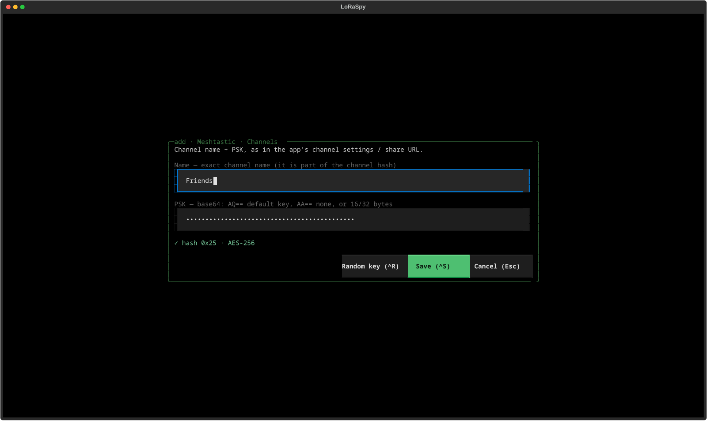

# LoRaSpy

Receive-only LoRa monitor for **Meshtastic**, **LoRaWAN** and **MeshCore**. An **RTL-SDR v4**
and **GNU Radio** (with [gr-lora_sdr](https://github.com/tapparelj/gr-lora_sdr)) demodulate
LoRa frames off the air, then Python decrypts and decodes them. Output uses the same styles
as meshprobe: `text`, `hex`, `hextext`.


<sub>The btop-style TUI (`--tui`) decoding a simulated recording (`tools/simulate_iq.py`):
LoRaWAN uplinks/downlinks on 868.1–868.5 MHz, Meshtastic and MeshCore around 869.5 MHz.</sub>

| Protocol | EU defaults | Decodes |
|---|---|---|
| Meshtastic | EU_868 presets (LongFast 869.525 MHz SF11/250k, …), sync 0x2B | all portnums, channel PSKs, PKI DMs |
| LoRaWAN | EU868: 868.1/868.3/868.5 SF7–12/125k, SF7/250k, RX2 869.525 SF9+SF12 (inverted IQ), sync 0x34 | join requests (EUIs), DevAddr/FCnt/FPort/FOpts; MIC + payload with session keys |
| MeshCore | 869.618 MHz SF8/62.5k (firmware default, EU/UK narrow), sync 0x12 | adverts (Ed25519 signature checked), Public/#hashtag/private channels, DMs with your identity key |

```
RTL-SDR ─► freq-xlating FIR per preset ─► gr-lora_sdr RX chain ─► 16-byte Meshtastic header
                                                                   + encrypted Data
          ─► channel-hash lookup ─► AES-CTR (channel PSK) or X25519/AES-CCM (PKI DM)
          ─► protobuf decode ─► console (text / hex / hextext) and optional JSONL
```

One SDR feeds many demodulators at once. Receivers on the same frequency and bandwidth
share one channel filter. At 2 MS/s, all Meshtastic presets, the LoRaWAN EU868 plan and
MeshCore fit together: 29 demodulators on 8 filters, about 6× faster than real time on a
desktop CPU.

## Setup

```bash
# Arch/Manjaro: GNU Radio, osmosdr, rtl-sdr
sudo pacman -S gnuradio gnuradio-osmosdr rtl-sdr python-numpy python-scipy
pip install --user meshtastic cryptography

# gr-lora_sdr → ./deps/prefix (no system install). Or use AUR gr-lora_sdr-git.
./scripts/build_gr_lora_sdr.sh

cp config.example.jsonc config.jsonc   # then add your channels / keys
./loraspy.py info                  # check frequencies, channel hashes, keys
./loraspy.py listen
```

## Usage

```bash
./loraspy.py listen                          # decoded text
./loraspy.py listen --format hex             # xxd-style dumps: raw LoRa frame + decrypted payload
./loraspy.py listen --format hextext         # both
./loraspy.py listen --filter text,position   # only some packet types (+ "encrypted")
./loraspy.py listen --protocol lorawan       # only one protocol (meshtastic, lorawan, meshcore)
./loraspy.py listen --filter join,advert,group  # LoRaWAN join requests, MeshCore adverts + channel msgs
./loraspy.py listen --show-crc-errors        # also print corrupted frames
./loraspy.py listen --jsonl packets.jsonl    # log every frame as JSON
./loraspy.py listen --gain auto --ppm 1.5

# Interactive views
./loraspy.py listen --tui                    # btop-style terminal UI
./loraspy.py listen --gui                    # Qt window: spectrum + waterfall
./loraspy.py listen --tui --iq-file sim.cu8 --iq-loop   # UIs replay files in real time

# One SDR, many front-ends (see "Sharing one SDR")
./loraspy.py serve                           # headless owner; or just start any front-end first
./loraspy.py gain                            # running SDR: gain, tuner steps, ADC level / clipping
./loraspy.py gain 15                         # set it (shared by every front-end; 'auto' = AGC)
./loraspy.py --help                          # every command with its full argument list

# Record now, decode later (rtl_sdr writes cu8)
rtl_sdr -f 869775000 -s 2000000 -g 40 capture.cu8
./loraspy.py listen --iq-file capture.cu8 --iq-center 869775000 --iq-rate 2e6
```

## Sharing one SDR

GUI, TUI, text mode and Wireshark can all run at the same time on one RTL-SDR with one set
of decoders:

- The **first** LoRaSpy (any front-end, the Wireshark live capture, or `serve`) opens the
  SDR and shares it on a Unix socket, `$XDG_RUNTIME_DIR/loraspy.sock` (mode 0600, only
  your user can connect).
- Every **later** one attaches to it automatically: it gets the same decoded frames (rendered
  by the owner, which holds the keys and node databases), the spectrum and the statistics.
  A GUI/TUI that attaches also gets the last 300 packets.
- Controls are **shared**: ticking a decoder off or changing the FFT size/window in any
  front-end changes it for all of them, and the others' views follow.
- The SDR is **released when the last front-end closes**: if the owner is closed while others
  are attached it keeps running headless (`still sharing the SDR with …`) until they detach;
  Ctrl-C a second time stops it anyway. Attached GUI/TUI wait for a server and re-attach
  when one comes back; attached text mode exits.
- The status line shows the role: `own SDR`, `sharing SDR with N clients` or `attached to pid …`.

```bash
./loraspy.py listen --gui &                  # opens the SDR, shares it
./loraspy.py listen --tui                    # attaches
./loraspy.py listen --protocol meshcore      # attaches; filters only its own output
# Wireshark → "LoRaSpy (RTL-SDR, shared)" attaches as well
```

Options: `--connect` only attaches (error if nothing is running), `--standalone` opens the
SDR just for this process (no attaching, no sharing), `--socket PATH` picks another socket.
When attached, source options (`--ppm`, `--iq-*`, `--hard-decoding`, `--fft-size`) belong to
the owner and are ignored with a note (`--gain` is live: it changes the shared SDR's gain); `--protocol` then only filters this
front-end's output (text mode) instead of switching receivers off for everybody.

The spectrum FFT runs only while some front-end shows a spectrum (a few % of one core at
2 MS/s: numpy on every sample, FFT 1024 ≈ 4 %, 8192 ≈ 10 % measured here), so a text-only or
Wireshark-only session doesn't pay for it. Switching it on or off, or changing FFT size and
window, never rewires the GNU Radio flowgraph.

## Interactive views

Both views show the same things: the spectrum across the whole tuned range; **band
overlays** built from your receivers (every LoRaWAN channel separately, marked ↑ uplink /
↓ downlink, plus Meshtastic slots, MeshCore, and the EU868 duty-cycle sub-bands); a band
lights up when a packet is decoded in it; a live packet list with full details; and
decoder toggles.

**`--tui`** (Textual, styled after btop's default theme; screenshot at the top):
- A stats line: tuner, uptime, CPU, and frames per protocol.
- A spectrum panel: level bars, a waterfall covering about 20 s with ◆ marks where packets
  were decoded, a band ruler, and a frequency axis.
- A `decoders` table and a `packets` table, with a `details` pane for the selected packet.
- Keys (btop-style): `1` `2` `3` `4` show/hide the spectrum, decoders, packets and details
  boxes; `space` toggles the selected decoder; `m` `o` `w` toggle Meshtastic, MeshCore and
  LoRaWAN; `[` `]` step the tuner gain down/up, `g` toggles AGC; `k` keys & channels; `p` pauses the list,
  `f` freezes the spectrum, `x` clears, `q` quits.

**`--gui`** (pyqtgraph):
- A band strip of labelled channel bars (hover for details), above a spectrum with a
  peak-hold trace and a 30 s waterfall.
- Decoded packets are marked on the waterfall at their frequency and time, labelled with
  their type and sender.
- A decoder tree with checkboxes. A group box ticks or unticks all its receivers and shows
  "partial" when only some are on. Plus a packet table and a detail view.
- Toolbar: tuner **gain** slider + **AGC** checkbox, and the ADC level / **CLIPPING** warning.
- Keys: `1`–`4` show/hide the boxes (also toolbar buttons), `[` `]` gain down/up, `G` AGC, `K` keys,
  `R` or double-click resets the view, `Ctrl+,` opens Settings.

Turning a decoder off in either view stops it: its demodulator is gated off (and its channel
filter too when no other decoder uses it), so it costs next to no CPU and its frames are
neither shown nor logged.

## Tuning and channels

- **Frequency dial** (GUI toolbar, LCARS style): the SDR's centre frequency. Mouse wheel over
  a digit changes that digit (with carry), right click zeroes every digit to its right; the
  tuner follows 0.3 s after the wheel stops. `./loraspy.py tune 868.95M` does the same for
  headless runs (`tune` alone shows it). Retuning is shared by every front-end.
- Decoders **stay on their channels** when you retune: each channel filter just follows the new
  centre. Decoders whose channel falls outside the new 2 MHz window go idle (greyed in the
  decoder list, their bands hidden) and resume when you tune back.
- **Channel settings**: right click a decoder → *Channel settings…* opens a dial for its
  channel. Decoders sharing one filter move together (e.g. the Meshtastic presets on
  869.525 MHz/250 kHz, a LoRaWAN frequency with all its SFs); a Trusted Wireless hop channel
  moves on its own within 869.40–869.65 MHz. `./loraspy.py channel` lists the channels,
  `./loraspy.py channel LongFast 869.4M` moves one, `… LongFast reset` puts it back.
- Both are runtime settings: `config.jsonc` isn't rewritten, a restart uses the configured
  frequencies. IQ files can't be retuned (their channels can be moved).

The dial uses the Antonio font (SIL Open Font License, `meshsdr/fonts/`).

## Gain and clipping

The RTL-SDR's ADC has 8 bits. A strong nearby transmitter (a node on the same desk) at high
gain drives it to full scale: the signal is clipped, and the distortion turns into bit
errors, i.e. **CRC errors on packets from your own node**. So LoRaSpy watches every raw
sample:
- the GUI toolbar and TUI stats line show the **ADC peak level** of the last second, and a
  red **⚠ CLIPPING** with the share of clipped samples when |I| or |Q| reaches full scale;
- a frame received while the ADC clipped (or with its in-band level within 3 dB of full
  scale) is marked **⚠ CLIPPED**: in the text output, the packet lists, JSONL
  (`"clipped": true`) and Wireshark (`sdrmon.clipped`, with an expert-info warning).

Fix it by lowering the gain. The gain is a **live, shared** setting (as in SDRangel):
**AGC** (the tuner's automatic gain) or a **fixed gain** from the tuner's own steps (R828D:
0–49.6 dB), from the GUI toolbar, the TUI keys, or `--gain` (which on an attached front-end
changes the shared SDR). A good level for the loudest signals is roughly −10 to −30 dBFS;
for weak distant nodes raise the gain again. Changes aren't written back to `config.jsonc`
(`sdr.gain` stays the start value). IQ files have no gain.

## RSSI and SNR

The RTL-SDR has no RSSI register, so LoRaSpy measures signal levels from the samples:
- **Power tap:** each channel filter feeds a C++ power tap (|x|² averaged over 1 ms).
- **Per frame:** the frame's airtime is computed from SF, bandwidth, coding rate, length
  and preamble.
- **RSSI** is the highest mean power over an airtime-long window just before the frame was
  delivered. That's the total in-band power, which is also what SX126x chips report.
- **Noise** is the channel's quiet level (10th percentile of the preceding ~20 s).
- **SNR** = (RSSI − noise) / noise.

In simulation this measured SNR is within about 1.5 dB of the truth from 0 to 20 dB with
a spread of ≤1 dB, for all three protocols. gr-lora_sdr's preamble estimate reads 5–6 dB low
at 20 dB, so it's only kept in the JSONL (`snr_lora_db`).

Levels are in **dBFS** until you calibrate. **dBm** needs `sdr.rssi_offset_db`, calibrated at
the configured `sdr.gain`. A fixed gain changed at runtime shifts the offset by the gain
difference (approximate: the tuner's steps aren't exact); with AGC the level isn't
calibratable, so dBm is left out. One way to calibrate:
1. Put the SDR's antenna next to a Meshtastic node's antenna.
2. Let a third node transmit.
3. Compare the RSSI that the nearby node reports for a packet (the app's packet details or
   `meshtastic --listen` show `rxRssi`) with LoRaSpy's dBFS for the same packet ID.
4. Set offset = rxRssi − dBFS, and average over a few packets.

With calibration, dBm also goes into Wireshark's LoRaTap packet and current RSSI fields.

## Wireshark

Frames can go to Wireshark as **LoRaTap** (link type 270, pcapng), with Wireshark's own
dissectors plus bundled Lua ones:

| Sync word | Dissector | Shows |
|---|---|---|
| 0x34 LoRaWAN | Wireshark's built-in LoRaWAN | MHDR, DevAddr, FCnt, FPort, MAC commands, join request EUIs |
| 0x2B Meshtastic | `loraspy.lua` → `meshtastic` | 16-byte header (to/from/id, hop/ACK/MQTT flags, channel hash, next hop/relay), and the decrypted `Data` plus its payload through Wireshark's protobuf dissector (Position, User, Telemetry, Routing, …) |
| 0x12 MeshCore | `loraspy.lua` → `meshcore` | header, route, transport codes, path, advert (key, time, signature, flags, location, name), group/direct layout |
| all | `sdrmon` post-dissector | receiver, SNR, CRC, channel/key used, decrypted payload, text, LoRaWAN MIC/device/decoded values |

Wireshark can't decrypt Meshtastic or MeshCore itself, so LoRaSpy puts its decryption
results into each packet's pcapng comment (`sdrmon1 key=value …`), and the Lua dissectors
read them from there. Filters then work across all three protocols, e.g.
`meshtastic.from == 0xa1b2c3d4`, `meshtastic.portnum == 3`, `meshcore.type == 4`,
`sdrmon.channel == "LongFast"`, `lorawan.fport == 1`.

```bash
tools/wireshark/install.sh        # extcap + Lua plugin (symlinks) + protobuf search paths
```

Then pick **LoRaSpy (RTL-SDR, shared)** in Wireshark's capture interface list
(restart Wireshark after installing or updating). It attaches to a running LoRaSpy if
there is one (see "Sharing one SDR"); otherwise it opens the SDR itself and shares it, so a
GUI or TUI started afterwards attaches to Wireshark's capture. Its options (⚙ next to the
interface):
- **SDR** tab: config file, protocols, gain, or an IQ file to replay. The config and IQ file
  only matter when the capture opens the SDR; protocols then only filter what Wireshark gets;
  the gain also changes the gain of a LoRaSpy it attaches to.
- **Remote (UDP)** tab: *Receive the UDP feed instead* captures what
  `loraspy.py listen --wireshark-feed HOST:PORT` sends, e.g. from another machine with
  the SDR (set the listen address to 0.0.0.0 there; default port 47474).

To write a capture file instead: `./loraspy.py listen --pcap capture.pcapng`.

LoRaTap can only express bandwidth in 125 kHz steps, so MeshCore's 62.5 kHz shows as 0 there;
the real value is in `sdrmon.bandwidth`. LoRaTap's RSSI fields are filled only when
`sdr.rssi_offset_db` is calibrated (they're dBm). The measured dBFS values are always in
`sdrmon.rssi_dbfs`, `sdrmon.noise_dbfs` and `sdrmon.snr`.

## Encrypted FSK telemetry (Trusted Wireless)

In 869.40–869.65 MHz there are often narrowband **2-FSK frequency-hopping** telemetry networks:
7 channels 30 kHz apart, ~10 kBd, ±4 kHz deviation, a long `0101` preamble and an encrypted
payload — the published characteristics of Phoenix Contact *Trusted Wireless 2.0* radios
(Radioline, RAD-868), used for wireless I/O in water, energy and industrial plants. Enable the
listener with a receiver entry:

```jsonc
{ "protocol": "trustedwireless" }                       // the 7 channels 869.435 … 869.615 MHz
{ "protocol": "trustedwireless", "channels": [869.435, 869.465] }   // or your own list
```

Each hop channel gets a narrow C++ channel filter and a small 2-FSK demodulator (energy at
±deviation per symbol, symbol clock fitted to the zero crossings, sync-word lock). The payload
can't be decrypted, but every frame shows up in the packet lists, text output, JSONL and
Wireshark with:

- **station**: S1, S2, … clustered by received level, and **address field**: header bytes
  6–7, which followed the transmitting station in every long frame recorded so far;
- **role**: the first frame of an exchange (frames < 0.6 s apart) is the *initiator*
  (polling master), the rest are *replies*;
- size class, bits after the sync word, raw header bytes (bytes 0–4 behave like counters),
  level/SNR, carrier offset and duration.

It costs about half a CPU core with all 7 channels on; untick the "Trusted Wireless" group in
the decoder list to stop it.

## IQ recordings

`loraspy.py record` saves raw IQ samples, for looking at signals LoRaSpy doesn't decode
(inspectrum, URH, GNU Radio, rtl_433, …). With a LoRaSpy running it records from the shared
SDR while decoding carries on; otherwise it opens the SDR just for the recording.

```bash
./loraspy.py record --freq 869.525M --bw 40k --duration 60     # one 40 kHz channel → 50 kS/s
./loraspy.py record --freq 869.5235M --bw 200k --format cu8    # cu8 for rtl_433 / rtl_sdr tools
./loraspy.py record --duration 5                               # whole tuned band, 2 MS/s
./loraspy.py record --list                                     # what the running LoRaSpy recorded
```

- A slice (`--freq` + `--bw`) is shifted to 0 Hz, filtered and decimated to ≥ 1.25 × the
  bandwidth (polyphase: a few % of one core per recording); without `--bw` the whole tuned
  band is kept as received (16 MB/s in cf32).
- Files go to `recordings/` next to the config (gitignored): `NAME.cf32` (complex float32) or
  `NAME.cu8` (rtl_sdr bytes), plus `NAME.json` with centre frequency, sample rate, start
  time, gain and tuner settings.
- Several recordings can run at once, up to 600 s each.

## Channels and keys (editor)

Channels, PSKs and keys can be added, edited and removed while LoRaSpy runs, from three
places. All of them go through the process that owns the SDR, so the decoders take the change
over at once (no restart), and every attached front-end sees it:
- **GUI:** toolbar **🔑 Keys** (key `K`): tabs Meshtastic / MeshCore / LoRaWAN, a table per
  key type with Add / Edit / Remove, a form that checks the entry as you type (shows the
  channel hash or derived public key, or what's wrong), a *Random* button for new PSKs /
  secrets, and *Show keys* to unmask.
- **TUI:** key `k` (screenshots below): list of all entries; `a` add (pick the type, fill the form, `^R` random
  key, `^T` show/hide, `^S` save), `e`/Enter edit, `d` delete, `s` show keys, Esc back.
- **CLI** (also for headless `serve`/`listen`; without a running LoRaSpy it edits the
  file, applied at the next start):
  ```bash
  ./loraspy.py keys                                     # list (secrets masked)
  ./loraspy.py keys show                                # the same with the keys in full
  ./loraspy.py keys show channel 0                      # just one type / one entry
  ./loraspy.py keys kinds                               # types and their fields
  ./loraspy.py keys add channel name=MyChannel psk=base64key=
  ./loraspy.py keys add channel name=MyChannel psk=random   # new random AES-256 PSK
  ./loraspy.py keys add pki-private node=!1337b4b3 private_key=base64= label="my node"
  ./loraspy.py keys add mc-channel name=#test          # MeshCore hashtag channel
  ./loraspy.py keys add lw-otaa dev_eui=70B3D57ED0000000 app_key=32hex label=sensor
  ./loraspy.py keys edit channel 0 psk=otherkey=        # only the given fields change
  ./loraspy.py keys remove channel 0                    # N = the #N from `keys`
  ```

| Keys & channels (TUI `k`) | Adding a channel (`a`, `^R` random key) |
|---|---|
|  |  |

Types: `channel` (Meshtastic name + PSK), `pki-private` / `pki-public` (Meshtastic DMs),
`mc-channel`, `mc-identity`, `mc-public` (MeshCore), `lw-session` (ABP / session keys),
`lw-otaa` (DevEUI + AppKey).

Edits are stored in **`keys.jsonc`** next to `config.jsonc` (created user-only, 0600, and
gitignored) and merged with it at load: lists are appended, pinned-key maps merged.
`config.jsonc` itself is never rewritten, so its comments stay; its entries show up in the
editors greyed / as `config` and can only be changed in the file (then restart). Every
entry is checked with the same parser the config uses before it is saved.

## Configuration (`config.jsonc`)

JSON with `//` and `/* */` comments and trailing commas. See `config.example.jsonc`, which
documents every key. The main sections:

| Key | Purpose |
|---|---|
| `region` | Meshtastic region (`EU_868`, `US`, ...). Used to work out each preset's frequency. |
| `sdr` | device string, `sample_rate`, `gain` (dB or `"auto"`), `ppm`, `dc_clearance_hz`, optional `center_frequency_hz`, `bias_tee` |
| `receivers` | Meshtastic `{ "preset": "LONG_FAST" }` (optionally `primary_channel` / `channel_num`, or explicit `frequency_hz` / `bandwidth_hz` / `spreading_factor`), `{ "protocol": "lorawan", "plan": "EU868" }`, `{ "protocol": "meshcore", "preset": "EU_UK_NARROW" }` |
| `channels` | `[{ "name", "psk" }]` with the PSK in base64 as shown in the apps (`AQ==` is the default key) |
| `pki.private_keys` | `[{ "node": "!xxxxxxxx", "private_key": "base64" }]` for reading PKI direct messages |
| `pki.public_keys` | `{ "!xxxxxxxx": "base64" }` optional pinned public keys |
| `node_db_file` | where node names and public keys learned from NODEINFO are stored |
| `meshcore.channels` | `[{ "name", "secret" }]` (hex/base64). `{ "name": "#test" }` derives the hashtag key. Defaults to Public. |
| `meshcore.identities` | `[{ "name", "private_key" }]`: 64-byte exported key, for DMs |
| `lorawan.sessions` | `[{ "dev_addr", "nwk_s_key", "app_s_key", "label" }]` for MIC check and decryption |
| `output` | `format`, `colored`, `show_crc_errors`, `show_undecrypted`, `jsonl_file` |

### Frequencies

Each preset's frequency comes from the firmware formula
(`RadioInterface::applyModemConfig`): `slot = djb2(primary channel name) % numChannels`.
If your mesh's primary channel has a custom name, set `"primary_channel"` on the receiver,
or give `frequency_hz` directly. `./loraspy.py info` prints the result, e.g.
EU_868 LongFast → 869.525 MHz, US LongFast → 906.875 MHz.

### Direct messages

- **Channel-key unicasts** are encrypted with the channel PSK and decode through `channels`.
  Since 2.5 the firmware refuses to send a *text* DM without the recipient's public key
  (`Router.cpp`, `PKI_SEND_FAIL_PUBLIC_KEY`), so these are now mostly NodeInfo, traceroute,
  routing/ACK and position unicasts, plus DMs from pre-2.5 nodes.
- **PKI DMs** (firmware 2.5+, channel hash byte `0x00`) use X25519 + AES-256-CCM. A PSK does
  not work for these. You need the **private key of one of the two nodes**, plus the other
  node's public key. Public keys are picked up automatically from NODEINFO broadcasts and
  saved to `node_db_file`, and you can also pin them in `pki.public_keys`. You can read a node's
  private key in the app's Security settings or with `meshtastic --get security.private_key`.
  Only use keys for nodes you own or administer.

## How it works

| File | Role |
|---|---|
| `meshsdr/radio.py` | region table, modem presets, frequency-slot hash (ported from firmware) |
| `meshsdr/flowgraph.py` | GNU Radio graph: osmosdr / IQ file → per-receiver xlating filter → gr-lora_sdr → `FrameSink` |
| `meshsdr/packet.py` | 16-byte over-the-air header (`to`, `from`, `id`, flags, channel hash, next_hop, relay_node) |
| `meshsdr/crypto.py` | channel hash, AES-CTR, X25519/AES-CCM (ported from meshprobe) |
| `meshsdr/decoder.py` | tries PKI first, then channels whose hash matches, like the firmware's `perhapsDecode()`; spots rebroadcasts |
| `meshsdr/formatter.py` / `hexdump.py` | meshprobe-style console output and JSONL |
| `meshsdr/nodedb.py` | names and public keys learned from NODEINFO |
| `meshsdr/lorawan.py` | LoRaWAN 1.0.x PHYPayload, MIC (AES-CMAC), FRMPayload decryption |
| `meshsdr/core.py` | `MonitorCore`: flowgraph, decoders, stats and spectrum, shared by text/TUI/GUI |
| `meshsdr/bands.py` | band overlays from the receivers; EU868 regulatory sub-bands |
| `meshsdr/tui.py` / `gui.py` | the Textual and pyqtgraph front-ends |
| `meshsdr/pcap.py` | LoRaTap v1 header, pcapng writer, sdrmon comments, UDP feed |
| `tools/wireshark/` | extcap (`loraspy_extcap.py`), Lua dissectors (`loraspy.lua`), Meshtastic `.proto` files, `install.sh` |
| `meshsdr/meshcore.py` | MeshCore packet/path parsing, adverts, AES-128-ECB + HMAC channel/DM crypto, Ed25519→X25519 |
| `tools/simulate_iq.py` | generates a synthetic IQ file of Meshtastic traffic for testing without hardware |

Notes:
- The tuner frequency is chosen so every receiver sits in the flat 90 % of the passband and
  the RTL-SDR's DC spike stays `dc_clearance_hz` outside every channel.
- LoRaWAN downlinks use inverted IQ (handled by conjugating the signal) and carry no payload
  CRC, so their contents are only checked by the MIC, and only when you have the keys.
- MeshCore floods are repeated by every repeater with a growing path. Copies are marked `[seen #n]`.
- `sample_rate` has to be an integer or rational multiple of 4 × bandwidth. 2 MS/s
  decimates directly. 2.4 MS/s goes through a rational resampler.
- SNR and RSSI are measured from the channel power (see "RSSI and SNR").

## Over-the-air testing with a USB node

`tools/air_test.py` makes a USB-connected node send known packets under each preset, waits
until the monitor has heard each one, and restores the node's original LoRa config at the
end. By default it sets hop limit 0 so test packets are not relayed across the mesh.

```bash
./loraspy.py listen --jsonl air.jsonl &     # config with every preset enabled (see config.example.jsonc)
tools/air_test.py send --presets LONG_FAST,MEDIUM_FAST,LONG_SLOW --channels 0,1 \
    --nodeinfo !a1b2c3d4 --traceroute !a1b2c3d4 --dm !a1b2c3d4 --jsonl air.jsonl --out sent.json
tools/air_test.py check sent.json air.jsonl
```

Tested on 2026-09-28 with a LilyGo T3S3 (fw 2.7.26) and an RTL-SDR Blog V4 on EU_868. All
seven presets that fit the band decoded (ShortFast, ShortSlow, MediumFast, MediumSlow,
LongFast, LongMod, LongSlow), along with a custom 32-byte-key channel, the default-key
channel, NodeInfo and traceroute unicasts and their replies, a routing ACK, and a PKI DM
decrypted with the sender's private key.

MeshCore was tested the same way, with the T3S3 reflashed to MeshCore companion v1.17.1
(`tools/meshcore_air_test.py setup` / `send`, run with a Python that has the `meshcore`
package). Everything decoded: zero-hop advert (sent as a DIRECT route with an empty path),
flood advert (both with valid signatures), Public and `#test` channel messages, and a DM.
The DM decrypts with either party's identity key, as long as the other party's public key
is known from its advert or from `meshcore.public_keys`.
LoRaWAN uplinks were tested with the T3S3 running a RadioLib ABP test sensor
(`~/code/lorawan/t3s3-sensor`). Everything decoded: DR0–DR5 (SF12–SF7) on 868.1, 868.3 and
868.5 MHz, unconfirmed and confirmed uplinks, a text uplink on FPort 2, and an OTAA join
request. The MIC was verified on every uplink, and the decrypted payloads matched the
sensor's own serial log. **LoRaWAN downlinks (RX1/RX2, inverted IQ, no CRC) have only been
tested in simulation**, because no network server answered the test device.

Things that bit during testing:
- **Sync word.** Real SX126x radios send 0x2B as symbols +16/−40 (signed nibbles).
  gr-lora_sdr's built-in conversion gives +16/+88, which matches only at SF7. Before this was
  fixed, real traffic produced zero frames, while the simulator (which uses gr-lora_sdr's own
  TX) still passed. See `radio.sync_word_symbols()`.
- The node can hold a queued packet for up to about 20 s before sending it, and packets
  still queued when the LoRa config changes never air. Hence the driver's `--jsonl` wait.
- The first admin write after connecting was sometimes ignored, so the driver verifies and
  retries.

## Testing without hardware

```bash
tools/simulate_iq.py -c config.example.jsonc -o sim.cu8 --snr -10 --ppm 3 --write-sim-config sim.jsonc
./loraspy.py -c sim.jsonc listen --iq-file sim.cu8
```

For each protocol among the config's receivers, the simulator generates these packets:
- **Meshtastic:** NODEINFO, text, position, telemetry, a PKI DM, and a packet on an unknown channel.
- **LoRaWAN:** a join request, two uplinks, and an RX2 downlink with inverted IQ and no CRC.
- **MeshCore:** a signed advert, Public and `#test` channel messages, and a DM.

It writes the keys needed to decrypt them (a Meshtastic PKI key, a LoRaWAN session, a MeshCore
identity) into `sim.jsonc`.

## License

LoRaSpy is free software under the **GNU General Public License v3.0** (see `LICENSE`),
like Meshtastic and gr-lora_sdr it builds on. The Meshtastic protobuf definitions bundled in
`tools/wireshark/protobufs/` are from the Meshtastic project, GPL-3.0, with their own `LICENSE`.

Only publicly known default keys are part of this repository (Meshtastic `AQ==`, MeshCore's
"Public" channel). Your own channels and keys belong in `config.jsonc` / `keys.jsonc`, which
are gitignored.
